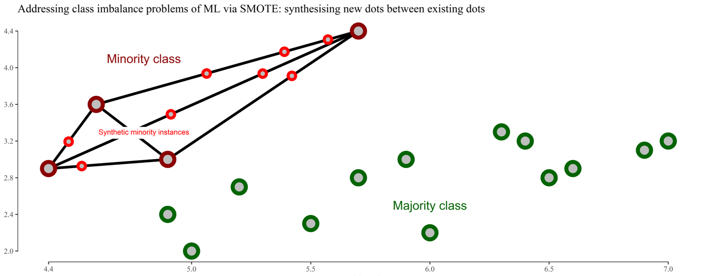
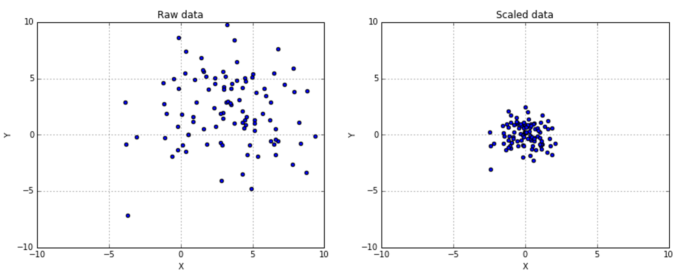
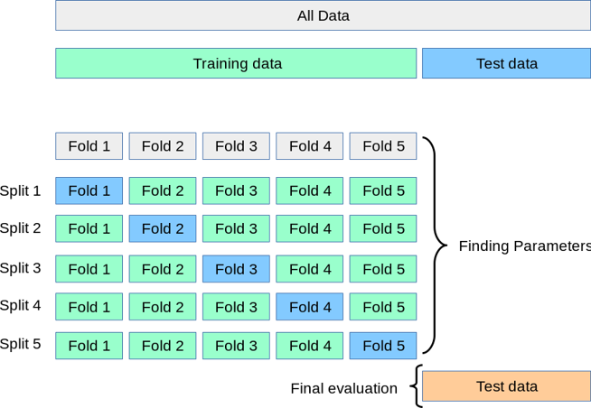
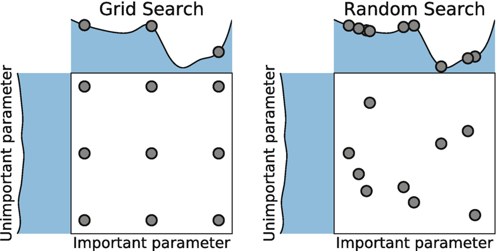

```{r setup, include=FALSE}
knitr::opts_chunk$set(echo = TRUE)
library(tidyverse)
library(caret)
library(caretEnsemble)
library(mlbench)
library(DMwR)
library(klaR)
library(magrittr)
library(RSNNS)
library(randomForest)
library(xgboost)
```

## Loading the Stranded / Long Waiter patient data

The data is loaded in using base R's read.csv() command. However, if the dataset was large I would suggest data.table as your go to, as it has been optimised for working with large flat files. 

```{r read_ml, echo=TRUE}
df <- read.csv("Data/Stranded_Data.csv", header = TRUE)
head(df, 10)
table(df$Stranded.label)
```

## Dealing with class imbalance
Synthetic Minority Oversampling Technique is used to rebalance an unbalanced classification. This can be problematic, when your number of samples of the label you are trying to predict are low. 

The image below shows how this is handled - essentially a radius is drawn around the sample and distance metrics are used to oversample a synthetic instance to that classification.

```{r smote, echo=FALSE, fig.cap="SMOTE Diagram", out.width = '50%'}

```

The implementation to rebalance my table is in the code hereunder:

```{r rebalance, echo=TRUE}
balanced_stranded <- SMOTE(Stranded.label~., df, perc.over=200, perc.under=120) %>% 
  as.data.frame() %>% 
  drop_na()
table(balanced_stranded$Stranded.label)

```
Viewing the table this has now been rebalanced and will improve the class representation in the model. 

## Scaling and standardising data

Another approach to reducing variance between features in your data is to scale and standardise the data in your ML model. This is advised for almost every ML algorithm in the book, and certain balancing techniques yield different results. It is all about trial and error. 

```{r scale, echo=FALSE, out.width = '50%'}

```

This is implemented either in the preProcess function in CARET or by using scale():

```{r scaled, echo=TRUE}
balanced_stranded %<>%  drop_na()
scaled <- preProcess(balanced_stranded[,2:ncol(balanced_stranded)], method=c("scale")) #Center could be added here
transformed <- predict(scaled, balanced_stranded[,2:ncol(balanced_stranded)])
summary(transformed)


```

Renaming factor levels and binding the original training label back to the scaled data is now necessary:


```{r bind, echo=TRUE}
dataset <- cbind(Stranded.label = balanced_stranded$Stranded.label, transformed)
levels(dataset$Stranded.label) <- c("Long.Waiter", "Not.Long.Waiter")

```

## Resampling and partitioning ML data

Resampling and partitioning comes in a few different flavours. These are:

* Hold out splitting
* Train and Test splitting
* Train, Test and Validation splitting
* K-Fold Cross Validation
* K-Fold repeated cross validation

The intuition is displayed in this chart:

```{r resamples, echo=FALSE, out.width = '50%'}

```
To split the data into a TEST and TRAINING dataset - we use the below code:
```{r hold_out, echo=TRUE}
train_split_idx <- caret::createDataPartition(dataset$Stranded.label, p = 0.75, list = FALSE)
data_TRAIN <- dataset[train_split_idx, ]
data_TEST <- dataset[-train_split_idx, ]
dim(data_TRAIN)
dim(data_TEST)
```

## Training the ML model on our training dataset

The next step is to set the training harness and pick which metric we want to optimise. As the dataset is now balanced, accuracy is the best measure of performance. However, I would advise against accuracy with an unbalanced classification strata.

```{r ml_away, echo=TRUE, include=FALSE}
eval_metric <- "Accuracy"
set.seed(123) # Random seed to make the results reproducible


nb_mod <- caret::train(Stranded.label ~ .,
                       data = data_TRAIN,
                       method = "nb", 
                       metric = eval_metric)
```

## Predicting on training set with test data

The next step is to use the test data to evaluate how accurate the Naive Bayes model is at classifying those patients who may or may not be long waiters. Here we use the stats::predict command to do this:

```{r ml_away_test, echo=TRUE}
nb_predict <- predict(nb_mod, newdata = data_TEST, type = "prob")
nb_class <- predict(nb_mod, newdata = data_TEST, type = "raw")
predictions <- cbind(nb_predict, nb_class) 

```

## Evaluating predictive accuracy with Confusion Matrix

A confusion matrix is used to analyse how many predictions our model got right. The code to use CARET's confusion matrices is hereunder:

```{r conf_mat, echo=TRUE}
cm <- caret::confusionMatrix(nb_class, 
                      data_TEST[,names(data_TEST) %in% c("Stranded.label")],
                      positive = "Long.Waiter")
cm

# Visualise confusion matrix

source('Functions/confusion_matrix_plot_function.R')
conf_matrix_plot(
  cm_input = cm,
  class_label1 = "Not Long Waiter",
  class_label2 = "Long Waiter",
)

```

This model has excellent accuracy and sensitivity is the measure we need, as it shows how right the model gets it. This is in the upper 90%'s. The oversampling did good work on the test data. 

Which features influenced it globally?

## Variable importance - Macroscopic / Global

The custom function below adapts on the boring variable importance plots and allows this to be visualised in a much nicer way:

```{r var_imp, echo=TRUE}
var_imp_plot_GH <- function(model, field) {
  .field <- rlang::enquo(field)
  .field_name <- rlang::quo_name(.field)
  
  imp <-caret::varImp(model)$importance %>% 
    as.data.frame() %>% 
    tibble::rownames_to_column(var="Metric") %>% 
    dplyr::select(Metric, !!.field) %>% 
    dplyr::mutate(Metric = as.factor(Metric))
  
  imp <- imp %>% 
    dplyr::mutate(Reodered= forcats::fct_reorder(Metric, !!.field))
  
  ggplot(data = imp,
         aes(x=Reodered,
             y=!!.field,
             label = !!.field)) +
    geom_point(stat="identity", aes(colour = factor(Reodered)), size = 6) +
    coord_flip() +
    ggthemes::theme_fivethirtyeight() + 
    theme(legend.position = "none") + 
    labs(title="Global variable importance")
}

# Calling the variable importance function

var_imp_plot_GH(nb_mod, Long.Waiter) 

```

You could also use LIME for local interpretation of importance and effect of variables on a local scale i.e. per patient: https://cran.r-project.org/web/packages/lime/vignettes/Understanding_lime.html


## ML algorithm benchmarking

Here I will not undertake a simple test and train split, I will use repeated K-fold cross validation to go through the data and pick out different training and test sets and then these will be resampled to train the model with the best combination:

```{r ml_bench, echo=TRUE}
seed_val <- 123
set.seed(seed_val)
ctrl <- trainControl(method="repeatedcv", number=10, repeats=3) 
# Create the training control resampling method
set.seed(seed_val)
rpart_mod <- caret::train(Stranded.label ~ . ,data = dataset, method = "rpart", trControl=ctrl)
#Logistic regression
set.seed(seed_val)
log_mod <- caret::train(Stranded.label ~ .,data = dataset, method = "glm", trControl=ctrl)
  
# Random forest 
set.seed(seed_val)
rf_mod <- caret::train(Stranded.label ~ ., data = dataset, method = "rf", trControl=ctrl)
#Collect the resamples
resample_results <- resamples(list(
                                     Rpart_Fit = rpart_mod,
                                     Logistic_Fit = log_mod,
                                     Random_Forest = rf_mod)
                              )
  
summary(resample_results)

```
Then I will use the lattice::dotplot() to review the models side by side. For a full list of models you can use, refer to the supplementary presentation on slide 18.
```{r ml_bench_dp, echo=TRUE}
dotplot(resample_results)

```

# Improving ML models

There are two additional ways models can be improved. The first is via hyperparameter tuning and the second is by creating ensemble methods, such as random forests.

## Hyperparmeter tuning

The two approaches baked into CARET, are grid and random tuning. These can be overridden manually, but you need to know what you are doing and searching for. I find when you are starting out that the random and grid defaults in CARET provide the best results normally and are easy to implement. The diagram below shows the difference between how each of the algorithms works:

```{r rs, echo=FALSE, out.width = '50%'}

```

### Random search
Caret's random search method uses a searching pattern, as outlined in the above. The below two hyperparameter techniques - random and grid search are a great starting point when looking to automate and tune the hyperparameters in your model. In the case of our random forest - this will be the number of mtry variables:

```{r ml_random_search, echo=TRUE}
seed_val <- 123
set.seed(seed_val)
ctrl <- trainControl(method="repeatedcv", number=10, repeats=3, search = "random")#, summaryFunction = twoClassSummary)
#The tuneLength parameter tells the algorithm to try different default values for the main parameter
system.time(
  rf_mod <- caret::train(Stranded.label ~ ., data = dataset, method = "rf", 
                       trControl=ctrl)
  )
print(rf_mod)
rf_results <- as.data.frame(rf_mod$results)
plot(rf_mod)

```

## Grid search aka exhaustive search
This tends to reduce performance, as the grid is searched in a linear fashion. To implement this type of grid you can use the following syntax:


```{r ml_grid_search, echo=TRUE}
seed_val <- 123
set.seed(seed_val)
ctrl <- trainControl(method="repeatedcv", number=10, repeats=3, search = "grid")
system.time(rf_mod <- caret::train(Stranded.label ~ ., data = dataset, method = "rf", 
                                   trControl=ctrl, tunelength = 2))
print(rf_mod)
rf_results <- rbind(rf_results, as.data.frame(rf_mod$results))
plot(rf_mod)

```

As this is a random forest, the hyperparameters that are tuned are the mtry parameters. You can implement a manual grid search, but I find that the default options work best. 

## Ensemble modelling

Ensemble modelling works by combining the predictions of a number of models and using a meta classifier to combine the model predictions by voting or averaging and then using the predictions as features in the meta classifier which will then predict the labels. 

The ensemble is created by using a mixture of CaretList and CaretStack - from the CaretEnsemble package to create the ensembling algorithm:

```{r ml_ens, echo=TRUE, include=TRUE}

tr_ctrl <- trainControl(method="cv", number =10, savePredictions = "final", classProbs = TRUE)
algo_list <- c("nb", 'lda', 'knn', 'glm', 'rf', 'rpart')
system.time(
  suppressWarnings(stacked_models <- caretList(
  factor(Stranded.label) ~ ., data = dataset,
  trControl = tr_ctrl, methodList = algo_list)
  ))
system.time(
  ensemble <- caretStack(stacked_models, 
                       method = "rf")
)


```

The results of the ensemble model are detailed hereunder:

```{r ml_ens_res, echo=TRUE}

ensemble
ensemble$ens_model$results
ensemble$ens_model$bestTune


```
The original random forest performs slightly better than our custom ensemble, however you could keep adding algorithms to the ensemble and I have found that this improves accuracy, but has significant impact on run time of the algorithm. 

## Save model

The trained ensemble will now be used, as the accuracy is excellent, to put the model into production. In the production example I will show you how to load this into your ML pipeline to make productions on live and unseen data:


```{r ml_save_model, echo=TRUE}

save(ensemble, dataset, df, file = "Models/ML_Production_Model.rda")
#Saves the ensemble ML model, the dataset we have been working with and the original data frame to 
# the files in the Models folder namely ML_Production_Model.rda

```
