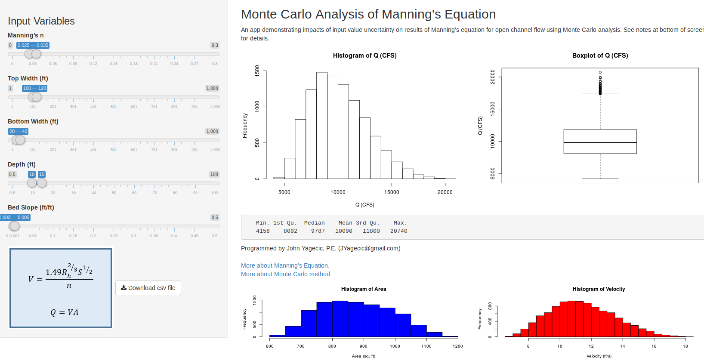
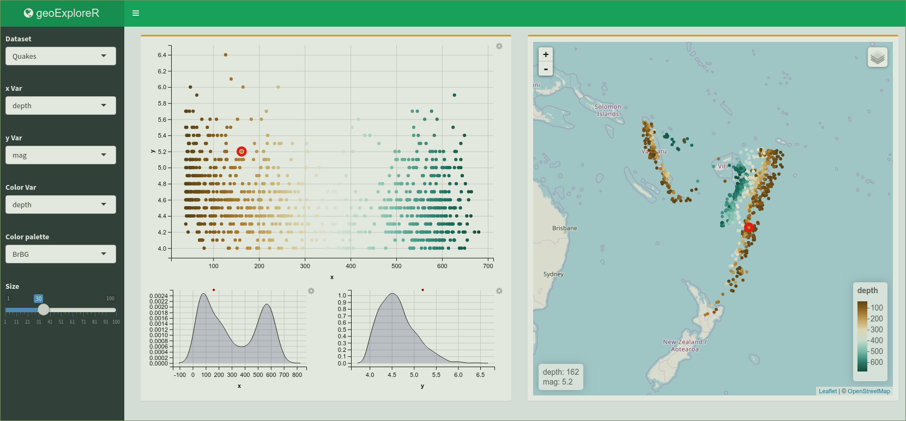
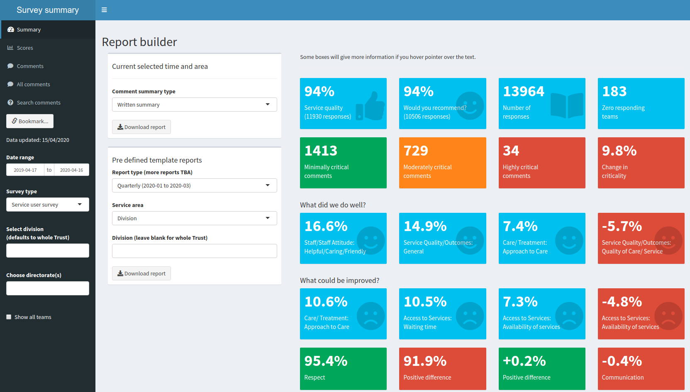

```{r setup, include=FALSE}

library(DiagrammeR)
library(shiny)

knitr::opts_chunk$set(echo = TRUE, eval = FALSE)

```

## What is Shiny?

* Shiny is a web application programming framework
* It's a big sack of HTML, JavaScript, and CSS, all called from R, basically
* It requires no knowledge of HTML, JavaScript, or CSS, but if you have that knowledge it will do more

## What does Shiny do?

* It does this

```{r, echo = FALSE, eval = TRUE}

shinyAppDir("~/R/x86_64-pc-linux-gnu-library/3.6/shiny/examples/01_hello/")

```

## But it also does this

```{r, out.width = "800px", echo = FALSE, eval = TRUE}



```

## And this

```{r, out.width = "800px", echo = FALSE, eval = TRUE}



```

## How does Shiny work?

* Reactive programming
* When the inputs change, the outputs change
* Outputs *take a dependency on* inputs
* The Bad Old Days
* What you lose
* E.g. CRUD is hard
* You can control reactive dependencies (more later)

## The fundamentals

* The fundamentals of Shiny apps are very simple
* There are two "bits" to a Shiny application
* The UI bit tells Shiny what inputs to define and where to put all the inputs and outputs
* The server bit tells Shiny how to make outputs- like graphs

## UI

* You define a bunch of inputs in one bit of your application using input generating functions
* Each input has a name
* You lay out your outputs using output layout functions
* Each output has a name

## Server

* Using the names you just defined, tell Shiny how to make each output
* You can access the value of inputs using input$nameOfInput
* It makes a lot of sense if you just browse the code, which we will do shortly...

## How to lay out your code

* There are actually two ways of defining Shiny applications
* Separate server.R and ui.R files
* One file called app.R
* I hate and despise single file applications and will be teaching multiple files

## WAIT, STOP!

* I hate to get into this now, but actually changes are afoot
* The create a Shiny application wizard supports multiple files
* But the new Shiny project wizard doesn't- just single files
* Hadley's forthcoming book makes no reference to two files
* I'm going to come back to this

## Let's browse some code

* A two file application (which we'll make live)

## UI- tabset panel

```{r, eval=FALSE}

tabsetPanel(id = "tabset",
            tabPanel("Graph", value = "graph", 
                     plotOutput("graph")),
            tabPanel("Map", value = "map", 
                     leafletOutput("trustMap", height = 600, 
                                   width = 500)
            )
)

```


## UI- Conditional panels

```{r, eval = FALSE}

conditionalPanel(
  condition = "input.tabset == 'graph'",
  textInput("trustControl", "Enter Trust name")
)

```

## UI - fluidRow

```{r, eval=FALSE}

fluidRow(
  column(width = 6,
         leafletOutput("trustMap", height = 600, width = 500)
  ),
  column(width = 6, 
         plotOutput("oneGraph")
  )
),

fluidRow(
  column(width = 8,
         "This input has lots of room"
  ),
  column(width = 4, 
         "And this input is pushed to the right hand edge"
  )
)

```

## Reactive expressions

- We'll look at some server code now starting with the use of a reactive expression
- Reactive expressions are expressions that change when their inputs change
- They enable you to maintain the data fetch/ clean code for several outputs in one place
- Crucially, they *cache* their results, which means that it's run once, for all the outputs, and only changes if its inputs change
- Great for computationally intensive or bandwidth heavy data functions

## Standard Shiny

```{r, echo = FALSE, warning = FALSE, eval = TRUE}

node_df <- create_node_df(n = 5 ,
                          label = c("Input 1", "Input 2", "Output 1", 
                                    "Output 2", "Output 3"),
                          fontsize = 24,
                          fillcolor = c("green", "green", "red", "red", "red"),
                          fontcolor = "black")

edge_df <- data.frame("from" = c(1, 1, 2, 2),
                      "to" = c(3, 4, 4, 5))

i_graph_1 <-
  create_graph()

i_graph_2 <-
  i_graph_1 %>%
  add_nodes_from_table(
    table = node_df,
    label_col = label)

i_graph_3 <-
  i_graph_2 %>%
  add_edges_from_table(
    table = edge_df,
    from_col = from,
    to_col = to,
    from_to_map = id_external)

i_graph_3 %>% render_graph()

```

## With reactive object

```{r, echo = FALSE, warning = FALSE, eval = TRUE}

node_dfR <- create_node_df(n = 6,
                           label = c("Input 1", "Input 2", "Reactive object", "Output 1", 
                                     "Output 2", "Output 3"),
                           fontsize = 24,
                           fillcolor = c("green", "green", "blue", "red", "red", "red"),
                           fontcolor = "black")

edge_dfR <- data.frame("from" = c(1, 2, 3, 3, 3),
                       "to" = c(3, 3, 4, 5, 6))

i_graph_1 <-
  create_graph()

i_graph_2 <-
  i_graph_1 %>%
  add_nodes_from_table(
    table = node_dfR,
    label_col = label)

i_graph_3 <-
  i_graph_2 %>%
  add_edges_from_table(
    table = edge_dfR,
    from_col = from,
    to_col = to,
    from_to_map = id_external)

i_graph_3 %>% render_graph()

```

## Reactive example

```{r}

filter_data <- reactive({
  
  sample_trusts <- ae_attendances %>% 
    filter(period >= input$date[1], period <= input$date[2]) %>% 
    arrange(Name)
})

```

## Render UI

```{r}

## UI side

uiOutput("trustControl")

## server side

output$trustControl <- renderUI({
  
  selectInput("trust",
              "Select Trust",
              choices = unique(filter_data()$Name),
              multiple = TRUE)
})

```


## Validate() and req()

```{r, eval = FALSE}

output$graph <- renderPlot({
  
  validate(need(input$trust, "Please select a Trust"))
  
  graph_data <- filter_data() %>% 
    filter(Name %in% input$trust)
  
  ...
})

```

## Uploading and downloading files

* Simple using fileInput() and downloadHandler()
* Can render Rmarkdown
- The logic is pretty simple but it's a bit involved to go into here
- You can just call the same functions that draw your outputs and put them into a .Rmd file
- Or you can pass parameters from Shiny into a parameterised report with its own set of functions
- Or both. It depends what you're doing
* Happy to accept questions or chat outside the webinar

## Interacting with a Shiny plot

```{r}

output$clickDetails <- renderText({
  
  # ... get the data in the graph here and call it oneTrust
  
  attendance <- nearPoints(oneTrust, input$plot_click, 
                           "period", "mean_attendance", 
                           threshold = 10)$mean_attendance
  
  paste0("Attendances: ", round(attendance, 0))
})

```

## Interacting with a map

```{r}

observeEvent(input$trustMap_marker_click, { 
  
  loc <- input$trustMap_marker_click
  
  trust_id <- input$trustMap_marker_click$id
  
  trust_details <- ae_attendances %>% 
    filter(org_code == trust_id) %>% 
    arrange(desc(period)) %>% 
    slice(1)        
  
  leafletProxy("trustMap") %>% 
    addPopups(loc$lng, loc$lat, 
              paste0(trust_details$Name, "<br>",
                     "Attendances: ", trust_details$attendances, "<br>",
                     "Breaches: ", trust_details$breaches)
    )
})


```


## shinydashboard

* This is for when you get bored of all your applications looking the same
* Shiny dashboard applications look like this

```{r, out.width = "800px", echo = FALSE, eval = TRUE}



```

## Debugging

- Start simple
- Make sure your code works outside of Shiny!
- Use of cat()
- Breakpoints and browser()
- Run options(shiny.reactlog=TRUE)
* Run
* Press Ctrl+F3 for an interactive summary of reactive activity in your application
* This has saved me more than once

## Code structure

* Now to return to that car wreck of an introduction
* If you're still learning about Shiny you can have a kip now or go to make a cup of tea
* Long code files are bad
* How I do it
- Only reactive datasets and renderUI in the server file
- Everything else has its own code file
- `source("codeFile.R", local = TRUE)`
* **Organise** your code files

## The Shines, they are a-changing

* Shiny 1.5 (which is not released yet) automatically sources the contents of the R/ folder
- No more messing around with source(... local = TRUE)
* Hadley Wickham's book seems to assume that you use single file app.R and source functions in the R/ folder
* It's good practice to separate your business logic from your Shiny functions
- Easier to debug and, crucially, to test
* Golem is in two files

## What's Golem?

* Golem is an "opinionated framework for building production-grade shiny applications" (https://github.com/ThinkR-open/golem)
* I think Golem is going to be really, really important
* It makes building a Shiny application equivalent to making a package
* They emphasise the use of modules (which I don't have time to go into)
* Comes with functionality to manage package dependencies, deploy, and turn into a CRAN package
* Robust, modular, testable, productionised, easily deployable applications

## More...

* Controlling reactivity with observe and isolate
* Bookmarks
* JavaScript
* Crosstalk
* Saving and loading data, and databases

